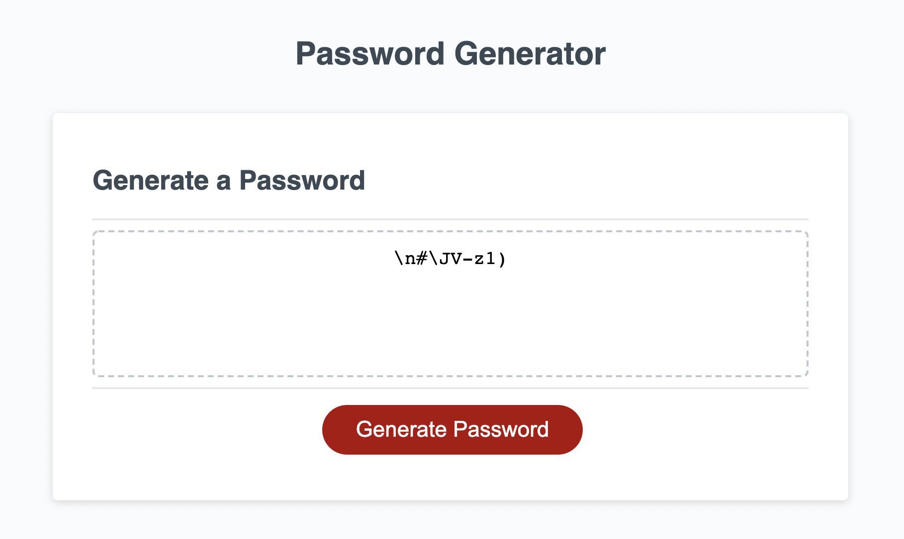

# My Portfolio

## Description

I modified starter code on an application that generates random passwords based on certain parameters selected by the user. This app runs in the browser and features dynamically updated HTML and CSS powered by JavaScript code that I wrote. It has a clean and polished, responsive user interface that adapts to multiple screen sizes.

### Installation

Upon loading the page, click the red button to initiate a series of prompts to enter desired password length and select criteria for a random password.

View my project as it is deployed via GitHub: https://vmichalecki.github.io/password-generator/

Clone my repo: https://github.com/vmichalecki/password-generator/

